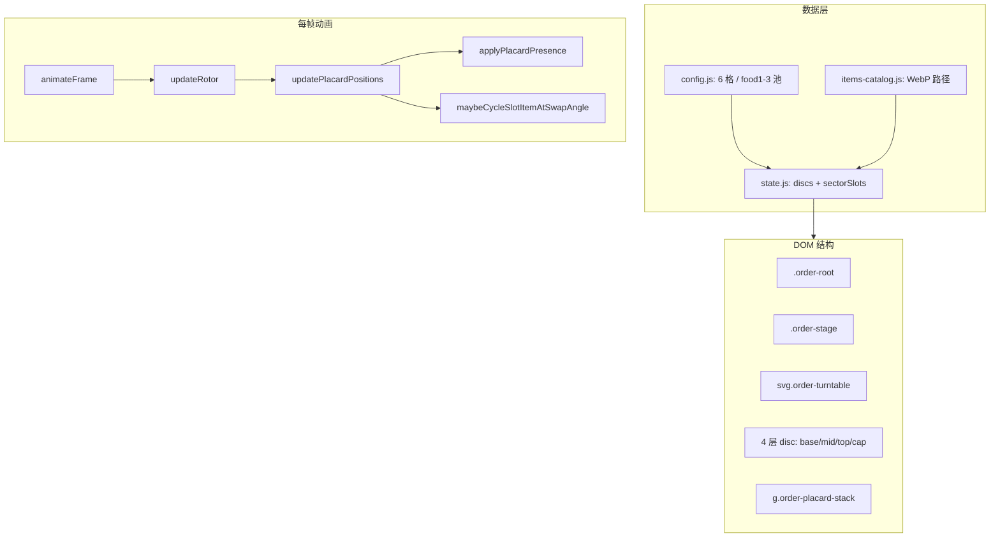

# 点餐转盘食物展示逻辑

Yummi 点餐页**没有静态 HTML 转盘结构**；食物通过 order 模块在运行时生成 SVG，用极坐标定位 + 轨道角控制可见性 + 275° 换菜，实现「立牌在椭圆转盘上公转展示」的效果。

---

## 1. HTML 从哪里来

[`index.html`](../../../index.html) 只有空壳挂载点 `#screen-root`，**没有**转盘 DOM：

```html
<div id="app" class="app">
  <main id="screen-root" class="app-main" role="main"></main>
</div>
```

[`js/main.js`](../../../js/main.js) 为每个 Tab 生成 `.panel-body[data-screen-mount="order"]`；[`screen.js`](screen.js) 在 mount 时执行：

```javascript
mount: function (container, mountCtx) {
  container.classList.add("order-module");
  container.innerHTML = mod.view.render(state);
  mod.view.bind(container, mountCtx || ctx, state);
}
```

**结论：** 转盘与食物立牌 100% 由 [`view.js`](view.js) 的 `render()` → `renderSvg()` 字符串拼接生成。

调试入口：[`dress-preview.html`](../../../dress-preview.html)（同样挂载 order 模块）。  
**独立调参页（含立牌）：** [`wmx-temporary/转盘/index.html`](../../../wmx-temporary/转盘/index.html) + [`placards.js`](../../../wmx-temporary/转盘/placards.js)。

---

## 2. 整体架构（分层）



**关键设计：** 盘面扇区在椭圆 `scale(1, ry/rx)` 组内旋转；**食物立牌单独放在 `order-placard-stack`**，不在 scale 组内，避免图片被压扁，位置由 JS 每帧用数学投影计算（见 [`css/modules/order.css`](../../../css/modules/order.css) 第 124 行注释）。

---

## 3. SVG 结构：食物在哪里

[`renderSvg()`](view.js) 组装顺序：

1. `<defs>` 渐变 + 地面阴影
2. 四层 `renderDisc()`（base / mid / top / cap）— 含侧壁、顶面转子 `[data-disc-rotor]`、拖动热区
3. **`renderPlacardStack()`** — 仅 base / mid / top 有食物，cap 无

立牌层绘制顺序（先画的在下层）：

```javascript
var PLACARD_LAYER_ORDER = ["top", "mid", "base"];
```

每层 6 个 slot，由 `renderPlacardSlots()` → `renderHotpotPlacard()` 生成。单个立牌 DOM 结构：

```javascript
'<g class="order-disc__slot" data-order-slot="..."' +
  ' data-slot-index="..." data-slot-center-angle="..." data-slot-x="..." data-slot-y="..."' +
  ' transform="translate(anchor.x anchor.y)">' +
  '<g class="order-disc__placard-presence">' +
    '<ellipse class="order-disc__slot-base" ...></ellipse>' +
    '<g class="order-disc__placard-rise" transform="translate(0 drop)">' +
      '<g class="order-disc__placard-body">' +
        '<image class="order-disc__slot-image" data-order-slot-image="..." href="..." opacity="0"></image>' +
```

| 属性 / 节点 | 作用 |
|-------------|------|
| `data-slot-x/y` | 盘面局部极坐标（格心） |
| `transform="translate(...)"` | 每帧在 viewBox 中更新 |
| `opacity="0"` | 初始隐藏，由 `applyPlacardPresence` 按轨道角渐显 |

---

## 4. 食物数据来源

| 层 | 配置键 | 图片池 | 立牌最大边长 |
|----|--------|--------|-------------|
| base | `food1` | `source/compressed/10kb/` | 66px |
| mid | `food2` | 同上 | 54px |
| top | `food3` | 同上 | 45px |
| cap | 无 | 猫纹理侧壁 | — |

配置见 [`config.js`](config.js) 的 `discs` 与 `sectorCount: 6`。

[`state.js`](state.js) 初始化流程：

- `applyDiscItems(disc)`：从 catalog 取路径 → `disc.itemUrls[]`
- `createShuffledPlayOrder(n)`：打乱播放顺序
- `createSectorSlots(6, disc)`：6 格，每格 `{ centerAngle, imageIndex, deckCursor, swapArmed }`

`pickNextFoodIndex()` 换菜时从 shuffle deck 取下一张，并**避免同盘 6 格出现重复 imageIndex**。

---

## 5. 位置计算（核心数学）

### 5.1 格心极坐标

```javascript
function getSlotCenterOnDisc(disc, slot, innerRadius, outerRadius) {
  var slotRadius = innerRadius + (outerRadius - innerRadius) * CELL_RADIUS_RATIO;
  var pos = polarToCartesian(slotRadius, slot.centerAngle);
  return { x: pos.x, y: pos.y, centerAngle: slot.centerAngle };
}
```

- `CELL_RADIUS_RATIO = 0.58`：格心落在内外半径 58% 处
- 6 格 `centerAngle = i * 60° + 30°`

### 5.2 盘面角 → viewBox 坐标

```javascript
function getSlotPositionInProject(disc, localX, localY) {
  var rad = disc.angle * Math.PI / 180;
  return {
    x: localX * cos - localY * sin,
    y: localX * sin + localY * cos
  };
}

function getSlotPositionInViewBox(disc, localX, localY, geometry) {
  var pos = getSlotPositionInProject(disc, localX, localY);
  var scaleY = geometry.ry / geometry.rx;
  return {
    x: geometry.cx + pos.x,
    y: geometry.cy + pos.y * scaleY
  };
}
```

先绕 Z 轴旋转 `disc.angle`，再按椭圆 `ry/rx` 做 Y 缩放，加上盘心 `(cx, cy)`。

### 5.3 每帧更新

`updatePlacardPositions(disc)` 对每个 slot：

1. `setAttribute("transform", "translate(x y)")`
2. `setAttribute("data-depth-view", anchor.y)` — 供深度排序
3. `orbitDeg = getSlotOrbitDeg(disc, centerAngle)` → 换菜 + 可见性
4. `applyPlacardPresence(slotNode, disc)`

`updateRotor(disc)` 在更新 `[data-disc-rotor]` 旋转后调用上述逻辑，并 `sortPlacardDepth()` 按 Y 排序实现前后遮挡。

---

## 6. 可见性：「只显示转盘前弧」

不用 DOM carousel，而是用**轨道角 θ** 控制 fade/scale/blur：

```javascript
var PLACARD_PRESENCE = {
  solidStartDeg: 90, solidEndDeg: 100,
  fadeStartDeg: 232, fadeEndDeg: 270,
  swapDeg: 275, swapRearmDeg: 90
};

function getSlotOrbitDeg(disc, centerAngle) {
  return normalizeAngle(centerAngle + disc.angle);
}
```

| θ 区间 | 效果 |
|--------|------|
| 70°–80° | 渐显（scale 0→1，blur 4px→0） |
| 80°–250° | 完全可见 |
| 220°–260° | 渐隐 |
| 其余 | 隐藏（`visibility: hidden`） |

`applyPlacardPresence()` 对 `.order-disc__placard-presence` 施加 `scale()` + `opacity` + CSS `filter: blur()`。

**立牌始终竖直**：只 `translate` 移动，不给 `<image>` 加 rotate。

---

## 7. 换菜逻辑（275° 触发）

```javascript
function maybeCycleSlotItemAtSwapAngle(disc, slot, slotNode, orbitDeg) {
  if (orbitDeg < p.swapRearmDeg) slot.swapArmed = true;
  if (!slot.swapArmed || orbitDeg < p.swapDeg) return;
  slot.swapArmed = false;
  cycleSlotItem(disc, slot, slotNode);
}
```

- 每圈 θ 先经过 `< 90°` 重新武装 `swapArmed`
- 到达 **275°** 时换一张图（背面经过时用户看不见）
- `cycleSlotItem()` → `state.pickNextFoodIndex()` → 更新 `<image href>`，带 `?v=swapGeneration` 防缓存

---

## 8. 动画与交互

`animateFrame(timestamp)` 主循环：

- 拖动中跳过该 disc
- 否则惯性衰减或 `autoSpeed` 同向自转
- 每 disc 调用 `updateRotor(disc)`

| 机制 | 实现 |
|------|------|
| 盘面顶面 | `[data-disc-rotor]` SVG `rotate(disc.angle)` |
| 立牌 | 不挂在 rotor 下，靠 `updatePlacardPositions` 数学跟随 |
| 拖动 | `[data-disc-hit]` / `[data-disc-hit-side]` pointer 事件 → 改 `disc.angle` + 惯性 |
| Tab 隐藏 | `screen.onHide()` → `view.pause()` 停 RAF |

各层 `autoSpeed` 在 [`state.js`](state.js) `createDiscs()` 中定义（当前四层统一为 8°/s，同向转）。

---

## 9. 图片布局

- 初始 `opacity="0"`，加载后 `applyPlacardImageLayout()` 按原图比例缩放，最长边 ≤ `disc.itemSize`
- `preloadDiscItems()` 预加载并缓存 `naturalWidth/Height`
- 小椭圆底座 + `placardDrop` 偏移模拟「立在盘上」

---

## 10. 相关文件速查

| 职责 | 文件 |
|------|------|
| 转盘几何 / 食物池配置 | [`config.js`](config.js) |
| 食物 WebP 路径 catalog | [`items-catalog.js`](items-catalog.js) |
| 状态、shuffle、换菜索引 | [`state.js`](state.js) |
| SVG 渲染、定位、动画、交互 | [`view.js`](view.js) |
| mount 生命周期 | [`screen.js`](screen.js) |
| 立牌样式（pointer-events、transform-origin） | [`css/modules/order.css`](../../../css/modules/order.css) |
| 原型参考（无立牌逻辑） | [`wmx-temporary/转盘/index.html`](../../../wmx-temporary/转盘/index.html) |

---

## 11. 一句话总结

**食物 = 6 个竖直立牌 SVG `<image>`，挂在独立 placard 层；每帧用「格心极坐标 + 盘面角 + 椭圆投影」算位置，用 θ = 中心角 + 盘面角 控制前弧渐显/渐隐，在 θ = 275° 静默换图，配合四层盘同向自转与整盘拖动，形成回转式选菜界面。**
